# Position Is Arithmetic

> A number-theoretic architecture for transformer inference and memory — where a token's position, index, and routing *are* exact arithmetic, not floating-point metadata about it.

**Live site:** https://nihilistau.github.io/Position_Is_Arithmetic/

**The main project is located at [Shannon-Prime-Lattice](https://github.com/nihilistau/shannon-prime-lattice) — you can join the Discord here: [Shannon-Prime-Lattice-Discord](https://discord.gg/rre9XZmvV).**

---

## What this is

Position Is Arithmetic is the public research home of the **Shannon-Prime** project: a fully local, byte-exact, **exact-integer** language-model **organism**. It serves a **frozen Gemma-4-12B** (the 4-bit `OK_Q4B` artifact) on **one RTX 2060 12 GB**, through the project's own inference engine, on a discrete substrate — `O_K = Z[(1+√-163)/2]` over `Q(√-163)`, a dual-prime negacyclic CRT-NTT. It is a ground-up re-derivation of the transformer forward pass in discrete integer arithmetic, plus a memory architecture (**PPT-ARM** / **XBAR**) that gives a frozen, pretrained transformer long, auditable, **model-owned** memory on commodity hardware.

As of the **KEYSTONE** milestone (2026-06-25), the pieces lock together into one self-supporting system: the served chat holds the conversation faithfully, **learns** facts as you state them and **recalls** them, **forgets / supersedes / merges** them on the model's own verdict, **calls tools and runs Python**, stores conversations in tiers (live → extracted facts → full+summary), and — between turns, on a heartbeat — consolidates the conversation and tidies its memory, with **zero manual steps**.

The thesis in one line: a transformer's positions, indices, and routing are arithmetic objects — primes, residues, lattices — so they can be **computed exactly** instead of approximated in floating point. That turns operations that are normally lossy (KV-cache compression, quantization, weight offload, and inter-model memory) into operations that are *bit-exact when disabled*, *gated when enabled*, and *receipted always*. Exact arithmetic buys **auditability and cross-machine determinism** — explicitly not, by itself, speed or compression; where the project wins on speed or size, it says so with a separate gate.

This repository holds the **receipts-first paper series** and the project's document history. Active code lives in the [linked repositories](#related-repositories); the headline implementation is [Shannon-Prime-Lattice](https://github.com/nihilistau/shannon-prime-lattice), and the complete current system is mapped in its foundation document `papers/PPT-LAT-KEYSTONE.md`.

**Navigation:** [`AGENTS.md`](AGENTS.md) is the entry guide (read order + the honest-status convention) · [`LEDGER.md`](LEDGER.md) is the master claims index (every number → a command + a commit) · [`METHODOLOGY.md`](METHODOLOGY.md) is the discipline · [`SERIES.md`](SERIES.md) is the manifest · [`HISTORY.md`](HISTORY.md) is the hashed, tiered commit log.

**Status labels used throughout** (and in [`LEDGER.md`](LEDGER.md)):

- **[PROVEN]** — measured and gated; the number has a ledger row and a command. Citable.
- **[WIRED]** — implemented and gated in-engine/in-core, running behind a flag — *not* a public citable row, *not* "on by default."
- **[DESIGN]** — specified, with its falsification gates pre-stated; not built.
- **honest negative** — measured and *refuted*, kept on the record on purpose (the 32k NIAH MISS, the nine refuted recall signals, the inert content-side number-theory levers).

## Measured results (citable)

Receipts-first: every number reproduces from a single command and traces to a row in [`LEDGER.md`](LEDGER.md). The unflattering numbers are kept attached on purpose.

| Result | Number | Scope / caveat |
|---|---|---|
| Resident KV-cache shrink @ 32k context | **910×** (7.5 GB → 8.3 MB) | two-ring offload to byte-addressable storage (01-R5) |
| Needle retrieved off a physical NVMe drive | **HIT at 512 positions** (7.57 µs/read) | poison-gated; latency figure is Optane-specific (01-R3/R4). **At 32k the composed run completed but MISSed** (B=512 = a 64× selection budget, far past the gated 2×–8× regime; 01-R9) — kept here on purpose |
| KV sparsification quality | **8× at +0.69% perplexity** | one corpus, 2k context (2× and 4× go negative) (01-R1) |
| Reducing loader (transcode) | **model → ~50% smaller, bit-faithful forward** | gemma-3 + Qwen3, closure-gated (paper 02) |
| Bit-exact when disabled | **argmax-identical to the stock model** | the invariant under everything (01-R8) |
| 12B GPU decode + quality, same RTX 2060 12GB | **26.1 tok/s at wikitext PPL 5.12** (graph EXACT, 256/256 top-1, 24/24 gates) | gated + citable (06-R10). llama.cpp-CUDA: 31.29 tok/s **at PPL 192–506** — every gemma-4 GGUF measurable in June 2026, incl. the post-fix rebuilds, carries broken weights (06-R8). SP engine bandwidth 245 vs 207 GB/s (+18%); the earlier 34.2 (+9.3%) headline is **retired** — its artifact failed the PPL gate (the series' own rule caught it) |
| The gemma-4 ecosystem finding | true full-precision PPL **4.68** (hand-written reference forward) vs GGUFs **192–506** | engine-independent conviction (06-R8); verification + fix tutorial: [GEMMA4-QUANT-FIX.md](GEMMA4-QUANT-FIX.md) |
| Latent crossbar probe: a 12B steered by direct KV-cache transplant, **no tokens** | **15/15 incorporation, 15/15 selectivity** (2×2 double dissociation), max single-token rank pull **3.69 orders** | gated + citable (X-R1). Coherence held under the gold instrument (steered-text PPL 1.70–4.10 vs gold 4.68); self-transplant null bit-identical 7/7; raw KV splice is a deliberately blunt instrument — the learned-adapter phase exists to refine it |
| O(1) KV decoupled from context on a 12B, needle retained | learned **512×32 LSH router** at **+0.47% PPL @8×** (oracle −0.08%, frozen +4.17%); **O(1) VRAM: 8k↔16k flat within ~50 MiB**; **NIAH needle survives 10/50/90% depth** | gated + citable (X-R2). The **KV term** is O(1); the absolute footprint in this backend-direct harness still carries the resident model. Frozen-router negative control MISSES — isolates the learned projection as the cause |
| Resident 12B daemon: disciplined silence + O(1) bit-exact rewind | **24-tick crucible perfect** (21/21 NO_OP, 3/3 ACTION, 0 false / 0 missed / 0 drift; 0.6B control collapses); **rewind byte-identical across all 48 layers** (diffs=0); metal **0.0073** vs prefix-grow **0.924 s/action** (127×) | gated + citable (KAIROS-01 / KAIROS-02). Scripted 24-event tape, not live sensors. The **≥24 h endurance soak is IN-FLIGHT** (no verdict from a mid-run log) — paper 09's release waits on its receipt |
| The crossbar **writes**: a stored episode replayed into a 12B's cache, bit-exact + load-bearing, without breaking perplexity | **replay intact == baseline (diffs=0); replay zeroed diverges 12/12**; replaying a *foreign* episode deflects PPL **+1.38%** (< the 2% gate) — proven on the 12B and the smaller E2B | gated + citable (X-R3). The deflection is over **n=42 positions, a single chunk** — deterministic (replay, not sampling), but a larger-N run is the named hardening lever before any headline |
| The model gains a **real-world audio sense on physical silicon** | real speech → 12B **pivots 7/8** (the 1 miss is a conservative ACTION→NO_OP); the front-end runs on a physical **Intel GNA 2.0** accelerator at **0.877 token-recovery == software-emulation == FP32** (a naive int16 sheared it to 0.667; calibrated int16 PTQ fully recovers) | gated + citable (KAIROS-04). Scripted event set, one model / one card / one GNA part; the audio "EAR" is a separate-but-related sibling of the latent-memory crossbar, sharing the same KV-inject seam |
| The **Memo curator** drives the crossbar autonomously | inert when off (**PPL 4.6665 bit-identical**); a **256-bit LSH / integer-Hamming** address (reduction-order-immune); **promote matched recall +0.000% / discard corrupted +40106%** | gated + citable (X-C2). The float→discrete course-correction (sign-binarize collapses at r=32, recovers ≥128, ship r=256). 2-episode registry vs synthetic noise; deflection single-chunk; Ring-2 verbatim recall only |
| **O(1) bit-exact rewind** of latent memory | replay into the resident cache load-bearing (zeroed reads back all-zero); rewind resets the prefix **byte-identical (layer-diffs=0)** on 12B + E2B, and across a sliding-window-ring wrap | gated + citable (X-222). The O(1) is in the byte-count (proven by byte comparison); the latency slope is KAIROS-02/03; persistent-ABI scorer port is a follow-on |
| **Parameter-free Ring-3** consolidation (VSA/HRR, zero training) | superposition recall@1=1.0 to N=32; consolidation loss a **step function** (hit +0.000% / miss +8.04% caught by the 2% gate); idle GC demotes **349.8 MB resident KV → a 16.3 KB index** | gated + citable (X-R3VSA). Retrieve-and-verify (P2.b top-5 honored). VSA retrieve is host-numpy (the Z_q/NTT engine port is the named follow-on); Path B (trained adapter) budget-gated, untouched |
| The **organism breathes**: real audio → episodic memory | audio-conditioned KV serialized as a canonical Ring-2 episode (11,206,656 B); signature separates (**self 211/256, margin +79**); round-trip clean (RT_EXIT=0) | gated + citable, **step 1** (X-ORG). The +1989% deflection is **foreign-by-design** (cross-context reject signal), not an audio-recall quality claim; the full audio-cue→recall loop is the open step; one model / one card / one GNA part |
| The crossbar's bind re-carried onto the **exact-integer O_K substrate** | the floating-point Ring-3 superposition is now **256/256 bit-identical** to the native integer path and **reduction-order-immune** (integer `M` byte-identical across 8 summation orders; float drifts 4.44e-15); live loop on native `sp_pr_mul`, CAP=32 unregressed | gated + citable (X-OK-BIND). The first negative: a number-theoretic `χ_d` *carrier* lowers coherence but is **inert** — the integer container is the win, not the integer carrier. One model / one card |
| Integer **Frobenius episode codec**, and the boundary of the algebra | rank-2 O_K codec **sub-ULP at 24 bits** (relL2 1.2e-7, 0.76× store); losslessness = **reconstruction fidelity, not a fake +0.000%** (the n=42 PPL gate is **blind below ~1%**, reported as such) | gated + citable (X-OK-FROB). Three boundary negatives kept on the record (entropy 1.02×, Möbius sheds memories, `T2`-on-weights ≈ random). **O_K wins on exact arithmetic, never on structuring high-entropy content.** One model / one card |
| The **organism breathes (full loop)**: cross-modal continuous→discrete→continuous on silicon | audio cue → discrete sig (audio 256 / decoys 147,129) → integer bind → retrieve top-1 (cos +0.47) → **C2 cross-modal verify** (accept audio / reject text) → integer Frobenius land (relL2 ~9e-8) → metal `SP_REPLAY` into the live 12B (checks=5, fails=0) | gated + citable (X-OK-ORG). The full loop is closed; **matched-context audio recall is not claimed** (the 88.89 PPL is the cross-context reject signal). Plus the period-8→6 rebase (separation cleaner, decoy 154→129). One model / one card / one GNA part |
| A **byte-exact 12B forward** — the four float "islands" killed | RMSNorm / softmax / GELU / RoPE now deterministic exact-integer (RoPE by **device CORDIC**, no `libm`; **no `__int128`** — `M ≈ 2^60` fits a `u64`); **OFF = PPL 4.6665 byte-identical to bf16 gold (null floor); ON = 4.6569 parity (−0.21% @ n=42); ON run-to-run bit-identical** | gated + citable (X-BX-ISLANDS). Byte-exact buys **auditability** (cross-machine determinism), **not speed or size**. The one open step is **external**: a bit-identical logit check across two *physical* GPUs (needs a 2nd machine). One model / one card |
| **One substrate, every backend** + an O(1) 12B decode through the daemon | a universal Rust crate is the **bit-exact reference** the C/CUDA/HVX backends gate to; attention's `⟨q,k⟩`/`p·V` → exact-integer dual-prime convolution (`p·V` `~2^46 ≪ M` ⇒ **no third prime**); daemon decode **32/32 tokens bit-identical to the oracle, VRAM flat (O(1))** | gated + citable (X-BX-WIRE). The decode bit-identity is on one host (the 2-GPU check is X-BX-ISLANDS's open step); "O(1) VRAM" is the KV-cache term. One model / one card |
| **Byte-exact ≠ compression** (the de-conflation) | the compression levers were **convicted** — incoherence rotation **~1.37×** / column reorder **~1.05×**, both **redundant vs `OK_Q4B`** (already gold PPL); and `T2` on the real 12B embedding reconstructs at cos **0.032 ≈ random** | gated + citable (X-BX-BOUNDARY). The boundary thesis: **O_K wins on exact arithmetic (the container), never on structuring content** — four content-side levers measured inert. And one honest negative about our process: the byte-exact linear algebra was *already in the bounded crate* — re-deriving it was the wasted motion |
| **Autonomous recall is NOT a hand-designed signal** (nine measured negatives) | **9 signals refuted** open-world (6 verifiers + 4 Disposer signals + cosine-q·K + ΔLL-polarity); best hand-design **2/3 rank, 1/3 consensus @ N=3**; the N-sweep made it WORSE (a super-attractor); the two "pristine" fixes (cosine, argmin-ΔLL) backfired | honest negative (X-B3-NEGATIVES). The binding constraint is the **corpus**, not the signal — parametric facts carry no episodic dependency to measure. Small-N (N≤6) curated; signals measured then discarded, none shipped |
| **Episodic dependency made measurable** — the teacher-forced ablation knockout | **novel-needle collapse −33.56 vs parametric −0.15 (~220×)**; 3-archetype matrix **−33.56 / −18.58 / −16.10** vs control band **[−0.15,+1.45]**; **TAU pinned −8.0**; the oracle is also a **perfect labeler** (separable diagonal); **200/200 admission** | gated + citable (X-B3-ABLATION). Teacher-force the secret, `cudaMemset`-ablate exactly its source KV rows, score ΣΔLL, `O(1)` rewind. "Parametric steel" — facts the model knows are unmeasurable; requires novel needles. Offline (needs the answer key); 1 model / 1 card |
| **The autonomous librarian is LIVE on the served 12B** — a learned W_c head | **360/361 recall + 50/50 foreign-reject, int16 == f32 lossless, s0 = +0.102** (`G-CHAT-B3-WC-DIV2`); instance top-1 **34% → 100%** under corpus diversity; reduction logsumexp-mean **361/361** (max 12 / top-8-mean 16); LIVE: matched → RECALL (9.858), "capital of France?" → NULL → "Paris" | gated + citable + **DEPLOYED** (X-B3-WC / X-B3-WC-DEPLOY). A learned head (HD=512→r=32, logsumexp-mean, (E+1)-NULL argmax, M=42 replay) on a **diverse** corpus — the win is a *learned* selector, not a hand-designed signal. Host-side, no frozen-ABI / `.sp-model` change; reject is relative (NULL-argmax), not an absolute threshold; 90-needle curated registry; 1 model / 1 card |
| The **NIGHTSHIFT offline curator** mints a Ring-2 episode on its own | model-call secret extraction → teacher-forced ablation admit → MEM-OKF emit: novel needle collapses **−33.59 → ACCEPT** (matches the −33.56 oracle), parametric `Paris` **0.00 → REJECT** (**~33-nat separation**, TAU = −8.0); emit conformant (rc=0, c2-sig joined, verify GREEN) | gated + citable on the **synthetic gate** (X-NS-CURATOR), criteria 1–4. **NOT live** — the live in-distribution criterion (criterion 5, on real chat turns) is **PENDING**; default-off null floor. The admission oracle inherits `parametric steel` (only novel needles measurable); 1 model / 1 card |
| **Whole-machine diffusion-judge throughput** (byte-exact perf levers) | **~1.46× from hoisting per-expert dequant scratch** (reversed 2×2 A/B: OFF 281/285 s vs ON 193/194 s, order-independent), **promoted default-on**, byte-identical by construction (X-DG-SCRATCHREUSE); plus a pinned **double-buffer prefetch byte-exact 240/240** (G-DG-ASYNC), ~1.3× marginal, **default-off / promotion pending** (X-DG-ASYNC) | gated + citable. The **26B-A4B MoE diffusion-gemma** judge, RTX 2060 12 GB. These are **throughput levers on the path, not judge-quality claims** — the judge's accuracy is unproven and held in the drawer. Async correctness required fixing a pre-existing dg_self_cond out-of-bounds (compute-sanitizer); its default-on promotion waits on a reversed-order timing lock + a full-corpus recall re-verify; 1 card |

Honest scope: this is a proof-of-mechanism, not a scaling study and not yet independently reproduced — on a single dev host (RTX 2060, 12 GB). The **0.6B** (Qwen3-0.6B) carries the two-ring memory ladder; the **12B** (Gemma-3-12B, QAT 4-bit — the B1 artifact) carries the XBAR and KAIROS results. CPU decode is ~1.34× behind a tuned llama.cpp at the same quantization. On GPU the citable point is the speed/quality PAIR: 26.1 tok/s at PPL 5.12 — a point no other stack currently occupies on this model at any speed, because their artifacts are broken. The memory envelope remains the primary value claim.

## The paper series

A staggered set of short, independently citable, receipts-first papers — each carries its own one-command reproduction.

- **01 — Two-ring memory** — query-directed recall + byte-addressable KV offload (the needle-off-NVMe result above).
- **02 — The reducing loader** — output-preserving transcode + zero-copy load (the ~50%-smaller, bit-faithful result).
- **03 — Frobenius calibration-free quantization** *(staged).*
- **[04 — The Oracle & the Teacher](papers/04-oracle-teacher/)** *(written)* — oracle-grounded backend verification: KL 2.7e-10 port, teacher-forced decode — plus the case study where a hand-written oracle measured gemma-4's true PPL at **4.68** and convicted the GGUF ecosystem (192–506) while exonerating llama.cpp's forward.
- **[05 — The Probe Suite](papers/05-probe-suite/)** *(written)* — bisection, isolation and benchmark hygiene **as one set** — from the 12.65× phantom and the 0/256 K-quant bug to ecosystem-scale forensics and simulate-before-build (artifact matched the simulator to four decimals).
- **[06 — Computing on the Zip File](papers/06-dp4a-bandwidth-ladder/)** *(complete, citable)* — the dp4a bandwidth ladder (f32 1× → int8 ~3.8× → Q4 ~7.06×), the OK_Q4B block-scaled kernel, the sovereign quantization pipeline, and the gated headline: **26.1 tok/s at PPL 5.12 on an RTX 2060 12GB**.
- **[07 — The Auditable Latent Crossbar](papers/07-auditable-latent-crossbar/)** *(written, citable — X-R1)* — a frozen 12B steered by direct KV-cache transplant, no tokens: **15/15 incorporation + 15/15 selectivity**, self-transplant null 7/7 bit-identical, gold-instrument coherence (X-R1).
- **[08 — O(1) KV: a context-decoupled cache](papers/08-o1-kv-learned-router/)** *(written, citable — X-R2)* — a learned **512×32 LSH router** decouples the KV cache O(1) from context: **+0.47% PPL @8×** (oracle −0.08%), **O(1) VRAM (8k↔16k flat ~50 MiB)**, **NIAH needle survives 10/50/90%** (frozen-router control misses) (X-R2).
- **[09 — KAIROS: a resident 12B daemon](papers/09-kairos-resident-daemon/)** *(written for the mechanism — KAIROS-01/02/03; full release held on the in-flight soak)* — disciplined silence + **O(1) bit-exact rewind**: 24-tick crucible perfect, rewind byte-identical across 48 layers, metal **0.0073** vs prefix-grow **0.924 s/action** (KAIROS-01/02), and the **wrap-aware journaled ring** uniting O(1)-time with O(1)-space + the semantic metal loop (KAIROS-03). The **≥24 h endurance soak is running now** — no verdict from a mid-run log; the full release ships on the receipt.
- **[10 — Receipts or it didn't happen](papers/10-receipts-or-it-didnt-happen/)** *(written)* — bit-exact-or-bounded as the contribution: the four documented self-corrections that prove the gates discriminate.
- **[12 — The Memo Curator](papers/12-memo-curator/)** *(written, citable — X-C2)* — autonomous discrete recall above the crossbar: the loop drives the closed substrate on its own, inert when off (PPL 4.6665 bit-identical), addresses memories with a **256-bit LSH / integer-Hamming** key (reduction-order-immune; sign-binarize collapses at r=32, ship r=256), and **promotes the matched recall / discards the corrupted one** (+0.000% / +40106% safety valve).
- **[13 — Speculate and Undo](papers/13-speculate-and-undo/)** *(written, citable — X-222)* — **O(1) bit-exact rewind** of latent memory: replay into the resident cache is load-bearing, the rewind resets the prefix **byte-identical** (12B + E2B; and across a sliding-window-ring wrap) — the §4-trap guarantee made mechanical, so the curator can speculate and undo for free.
- **[14 — A parameter-free neocortex](papers/14-parameter-free-neocortex/)** *(written, citable — X-R3VSA)* — VSA/HRR **Ring-3 consolidation** from discrete NTT, **zero training**: retrieve-and-verify (the P2.b top-5 verdict honored), with the consolidation loss a **step function** (hit lossless / miss caught by the 2% gate) and the idle GC demoting **349.8 MB resident KV → a 16.3 KB index**.
- **[15 — The organism breathes](papers/15-the-organism-breathes/)** *(written, citable — X-ORG)* — real audio to episodic memory: real speech → the EAR on **physical Intel GNA 2.0** (KAIROS-04) → the 12B pivots 7/8 → the audio-conditioned KV state becomes a **curator-indexable, replayable Ring-2 episode** whose signature separates cleanly from text memories (self 211/256, margin +79).
- **16–18 — The discrete container** *(written, citable)* — the memory architecture re-carried onto the project's own **exact-integer O_K substrate** (`Q(√-163)` / the dual-prime negacyclic CRT-NTT), and the boundary it draws: the integer container wins where *arithmetic* must be exact, while every attempt to make memory *content* itself number-theoretic is measured-inert and kept as an honest negative.
  - **[16 — The Unification](papers/16-the-unification/)** *(written, citable — X-OK-BIND)* — the Ring-3 holographic bind, which had been floating-point, re-carried onto the engine-native CRT-NTT: **256/256 bit-identical** to native `sp_pr_mul` and **reduction-order-immune** (integer `M` byte-identical across 8 summation orders; float drifts 4.44e-15); the live loop wired to the native multiply (CAP=32 unregressed); and the first negative — a number-theoretic `χ_d` *carrier* lowers coherence but is **operationally inert** (the integer container is the win, not the integer carrier).
  - **[17 — The Frobenius integer episode store](papers/17-frobenius-integer-store/)** *(written, citable — X-OK-FROB)* — the Ring-2 episode codec on the integer ring, **sub-ULP at 24 bits** (`a16b8`: relative L2 1.2e-7, 0.76× store), with losslessness established by **reconstruction fidelity, not a fake +0.000%** (the n=42 perplexity gate is honestly reported as **blind below ~1%**); plus the three boundary negatives — entropy-coding the codes (1.02×), Möbius over the superposition (sheds memories), `T2` on real model weights (recon ≈ random) — that draw the line: **O_K wins on exact arithmetic (the container), never on structuring high-entropy content**.
  - **[18 — The organism breathes (full loop)](papers/18-organism-on-silicon/)** *(written, citable — X-OK-ORG)* — the full cross-modal continuous→discrete→continuous loop on the integer substrate: real audio sensed on physical GNA → a discrete 256-bit signature (audio 256 / text decoys 147, 129) → integer superposition → audio cue retrieves top-1 (cos +0.47) → the **C2 cross-modal verify** (accept audio / reject text) → integer Frobenius land (K/V relL2 ~9e-8) → metal `SP_REPLAY` into the live 12B (checks=5, fails=0); plus the **period-8→6 rebase** to the true gemma-4 global layers (separation cleaner, decoy 154→129 — the paper-15 caveat retired).
- **19–21 — Byte-exact** *(written, citable)* — the *forward pass itself* carried onto the exact-integer substrate: the four nonlinear float "islands" killed, the universal-crate architecture that makes the exactness identical on every backend, and the de-conflation that keeps it honest — **byte-exact buys auditability, not compression**.
  - **[19 — Killing the float islands](papers/19-killing-the-float-islands/)** *(written, citable — X-BX-ISLANDS)* — the four nonlinear fp32 operations of the 12B forward (RMSNorm, softmax, GELU, RoPE) made deterministic exact-integer, with **no `libm`** (RoPE by a device **CORDIC**, the norm's reciprocal-root by a 64-bit `isqrt` split) and **no `__int128`** (`M = q1·q2 ≈ 2^60` fits a `u64`); `G-BYTEEXACT-FORWARD-12B`: **OFF = PPL 4.6665 byte-identical to bf16 gold (null floor); ON = 4.6569 parity (−0.21% @ n=42); ON run-to-run bit-identical** — the one open step is the external two-physical-GPU check.
  - **[20 — One substrate, every backend](papers/20-one-substrate-every-backend/)** *(written, citable — X-BX-WIRE)* — a universal Rust crate is both the L2 orchestrator and the **bit-exact reference** the C/CUDA/HVX backends gate to; attention's `⟨q,k⟩`/`p·V` become an exact-integer dual-prime **negacyclic-convolution dot** (a single coefficient = the plain dot; the `p·V` accumulator `~2^46 ≪ M` ⇒ **no third prime**); and the resident daemon drives the 12B over the L1 C ABI, with a new token-by-token decode verb — `G-WIRE-CUDA-DECODE-GEMMA4`: **32/32 tokens bit-identical to the oracle, VRAM flat (O(1))**.
  - **[21 — Byte-exact, not compression](papers/21-byte-exact-not-compression/)** *(written, citable — X-BX-BOUNDARY)* — the reflective record: the de-conflation (auditability vs compression), the **convicted** compression levers (incoherence rotation ~1.37× / column reorder ~1.05×, both redundant vs `OK_Q4B`), the **boundary thesis** on the forward (four inert content-side levers; `T2` on the real 12B embedding ≈ random), and the honest negative about our own process — the byte-exact linear algebra was *already in the bounded crate, bit-exact-gated*, and re-deriving it offline was the campaign's one wasted motion.
- **22–24 — The autonomous librarian** *(written, citable; the head is DEPLOYED LIVE)* — the orchestration tier above the closed read/write substrate: an autonomous recall loop that selects the *right* stored episode for a chat turn — or refuses. The arc is a boundary-thesis win with the negatives attached: nine hand-designed signals fail, a causal oracle on novel needles breaks the wall and labels a corpus, and a *learned* head on a *diverse* corpus does live instance-level recall with clean foreign-reject.
  - **[22 — The honest-negatives wall](papers/22-honest-negatives-wall/)** *(written, citable — X-B3-NEGATIVES)* — **nine** hand-designed relevance signals (6 verifiers + 4 Disposer signals — Yes/No bridge, first-token Δ-continuation, multi-token ΣΔLL, consensus — + cosine-q·K + ΔLL-polarity), **all refuted open-world**: best is raw q·K + argmax multi-token-ΔLL = **2/3 rank, 1/3 consensus @ N=3**; the N-sweep *amplified* a super-attractor confound, and the two "pristine" fixes backfired (cosine collapses the angle ~0.14; argmin-ΔLL picks the least-disruptive = most-irrelevant). The binding constraint is the corpus, not the signal — the negatives that justify the learned head.
  - **[23 — Parametric steel & the teacher-forced ablation knockout](papers/23-parametric-steel-ablation-knockout/)** *(written, citable — X-B3-ABLATION)* — parametric facts ("parametric steel") are unmeasurable (collapse ≈ 0: the model regenerates them from weights). The unlock is a **novel needle** + a **teacher-forced ablation knockout**: force the secret's tokens, `cudaMemset`-ablate **exactly** their source KV rows, score ΣΔLL — **novel −33.56 vs parametric −0.15 (~220×)**; 3-archetype matrix **−33.56 / −18.58 / −16.10** vs control band **[−0.15,+1.45]**, **TAU pinned −8.0**. The gate is both a shippable admission oracle **and** a perfect labeler (a separable diagonal); **200/200 admission** in one model load.
  - **[24 — The learned librarian](papers/24-the-learned-librarian/)** *(written, citable — X-B3-WC; DEPLOYED LIVE — X-B3-WC-DEPLOY)* — a learned **W_c** head (HD=512→r=32; relevance = **logsumexp over positions then mean over heads**; InfoNCE over [episodes + NULL/s0] + a reject hinge) does autonomous instance-level recall: **360/361 recall + 50/50 foreign-reject, int16 == f32 lossless, s0 = +0.102** (`G-CHAT-B3-WC-DIV2`). **Diversity** was the wall (templated **34%** → diverse **100%** instance top-1); the right reduction makes int16 lossless (**logsumexp-mean 361/361**, vs max 12 / top-8-mean 16); the reject is the **NULL slot of an (E+1)-way argmax**, not a threshold. **Deployed live:** matched → RECALL `ep_n_div_000` (9.858); "what is the capital of France?" → NULL → clean "Paris."
- **25–30 — KEYSTONE: the organism, integrated** *(the milestone arc — the night the arches locked together, 2026-06-25; foundation `papers/PPT-LAT-KEYSTONE.md` in the lattice repo)* — above the closed read/write/recall substrate, the served chat becomes a coherent **agent that owns its memory**. The arc, receipts attached:
  - **25 — The end-of-turn fix** — the served chat's rambling / fake-turn confabulation was **ours, not a weak model**: the end-of-turn token reaches rank 1 at the boundary in our forward but loses by one, so it never stops; a logit bias on the stop tokens (`SP_EOT_BIAS≈4`) ends turns cleanly. The recurring lesson made a paper: served-model misbehavior is almost always the template / decode / sampler / forward, not the weights (engine `9e4b40f`).
  - **26 — Conversational faithfulness** — the chat was *not* "restarting each turn" (the daemon carries the full conversation); the issue was the model leaning on **parametric priors over in-context grounding**. The fix is a default **system prompt** (identity + capabilities + "use the stated facts faithfully") that makes it faithful, plus the structural answer — reliable tiered recall (engine `88d924e`).
  - **27 — Memory agency: forget, decide, merge** — the model **decides what it keeps**: STORE (NIGHTSHIFT capture) + **FORGET** (`SP_FORGET`: "forget X" → token-overlap match → drop + rewrite the registry) + **DECIDE/MERGE** (`SP_DECIDE`: a side model-call, framed as *detection* with a forced answer prefix, supersedes a changed fact or consolidates two complementary facts into one synthesized truth). Gates `G-FORGET` / `G-DECIDE` / `G-MERGE` (engine `0fd52e4`). Default-off = null floor.
  - **28 — The deterministic judge** — the recall/reject **judge** is a **deterministic token-overlap (Jaccard) evidence verifier**, not a 26B model: a skeptical 12B proposal (TAG + EVIDENCE) → a Jaccard gate @≈0.6 → a confidence tiebreak. **N=40: recall 83% / reject 95%** — beating a 26B cascade (~53% / 98%) on an auditable CPU string op that frees the GPU. The 26B diffusion-judge cascade is retired (`G-JUDGE-BATTERY`).
  - **29 — The tool-calling harness** — the served model becomes an **agent**: ephemeral tool calling over the text-only daemon (the model emits `<tool name="…">{json}</tool>`, the harness parses, executes, and feeds the result back in a ReAct loop), plus memory-as-tools and the tiered conversation memory. Live: `calculate` → 4183, `run_python` → 5050 (harness `G-HARNESS-TOOLCALL-E2E`).
  - **30 — KAIROS: the agency heartbeat** — the organism *does things between turns*: an idle-gated scheduler consolidates the live conversation (facts → mid, transcript → long) and runs a model-driven maintenance round (the model curates its own memory). The loop closes with **zero manual steps** (harness `run_agency.py`, `G-HARNESS-KAIROS-TICK` / `G-HARNESS-HOOK-E2E`).
- **[GEMMA4-QUANT-FIX.md](GEMMA4-QUANT-FIX.md)** — community tutorial: verify the gemma-4 GGUF breakage yourself (engine-independent, ~30 min) and the working fix recipe. Ready-to-post issue text: [GEMMA4-ISSUE-POST.md](Archived/Documents/Revisions/GEMMA4-ISSUE-POST.md).

See [`SERIES.md`](SERIES.md) for the manifest and release cadence, [`LEDGER.md`](LEDGER.md) for the master claims ledger (every number traced to a command), and [`METHODOLOGY.md`](METHODOLOGY.md) for the gate vocabulary and the "no number without a command" discipline.

## The system: a four-tier memory hierarchy plus a latent crossbar

The original "two-ring" framing has grown into a four-tier hierarchy with an inter-model lane on top. Architecture ground truth lives in the lattice repo (`papers/RFC-XBAR-auditable-latent-crossbar.md`); this is the public map, each component tagged with its status.

The live recall path on the served 12B chat — *every write receipted, gated, and rewindable* — at a glance:

```mermaid
flowchart LR
    Q[chat turn] --> WC{"W_c head<br/>(E+1)-NULL argmax<br/>[PROVEN, live]"}
    WC -->|matched episode| REPLAY["replay @ bounded M=42<br/>into resident KV<br/>[PROVEN]"]
    WC -->|whole pop negative| NULL["NULL -> clean prompt<br/>(foreign-reject)<br/>[PROVEN]"]
    REPLAY --> EXEC["frozen Gemma-4-12B<br/>OK_Q4B, RTX 2060<br/>26.1 tok/s @ PPL 5.12"]
    NULL --> EXEC
    EXEC --> OUT[coherent, byte-exact,<br/>O&#40;1&#41;-context reply]
    R2[("Ring 2: verbatim<br/>O_K episode store<br/>[WIRED]")] -.episodes.-> WC
    CUR["NIGHTSHIFT curator<br/>ablation-admit (TAU=-8)<br/>[WIRED, synthetic gate]"] -.admit.-> R2
    EXEC -.rewind O&#40;1&#41; byte-exact.-> REPLAY
```



The static VRAM tier layout (the four rings + the modality lanes):

```
        ┌────────────────────────── VRAM (owned arena) ───────────────────────────┐
        │                                                                         │
        │   Exec (generator, e.g.               Memo (small curator,              │
        │   gemma-4-12B OK_Q4B)                 frozen-small)                     │
        │   causal forward, generates           non-causal pass over the episode  │
        │        │            ▲                        │             ▲            │
        │        ▼ write      │ attend                 ▼ propose     │ read       │
        │   ┌─ Ring 1 ─┐  ┌── Ring 2 (hippocampus) ┐  ┌─ Ring 2′ (shadow) ─┐      │
        │   │ working  │  │ verbatim Spinor KV,    │◄─│ Memo's proposals   │      │
        │   │ KV       │  │ recent + bounded       │  │ promote-on-accept  │      │
        │   └──────────┘  └────────────────────────┘  └─────────┬──────────┘      │
        │        ▲ recall from BOTH                             │ promote (gated) │
        │        │                ┌── Ring 3 (neocortex) ───┐◄──┘                 │
        │        └────────────────│ adapter pseudo-tokens,  │   G-R3-LOSS bounded │
        │                         │ consolidated long-term  │   (irreversible)    │
        │                         └─────────────────────────┘                     │
        │              modality lanes (one CRT prime per modality):               │
        │              audio adapter, video, ...                                  │
        └─────────────────────────────────────────────────────────────────────────┘
   Ring 2′ promotions: coherence/PPL delta → accept or REWIND (transient, reversible).
   Ring 3 promotions: G-R3-LOSS bounded BEFORE source eviction (permanent, irreversible).
```

### The four tiers

| Tier | Substrate | Representation | Lifetime | Biological analogue | Status |
|---|---|---|---|---|---|
| **Ring 1** | RAM/VRAM working window | verbatim KV, full attention | the live turn | sensory / working memory | **[PROVEN]** — the stock model path; everything else is bit-exact-when-off relative to it |
| **Ring 2** | byte-addressable storage (Optane validated), raw episodic store | verbatim Spinor KV blocks | recent episode (bounded) | **hippocampus** — recent, detailed, lossless | **[PROVEN]** — needle off physical NVMe, poison-gated, 7.57 µs/read (01-R3/R4); bounded on purpose: the composed 32k recall at a 64× selection budget MISSed (01-R9) |
| **Ring 2′** (shadow) | transient staging copy | proposals awaiting the gate | one consolidation pass | (no analogue — it is the *audit* mechanism) | **[WIRED]** — the C1-lite curator: clone → propose → gate → atomic promote / rewind, exercised on real recall, every promotion receipted |
| **Ring 3** | consolidated long-term store | adapter-compressed pseudo-tokens (n→k gist) | long-term | **neocortex** — old, dense, semantic | **[DESIGN]** — under the irreversible-aware **G-R3-LOSS** gate: consolidation loss is quantified and bounded *before* the raw source is evicted; un-compressible episodes stay verbatim in Ring 2 (a valid, logged outcome) |

The point of the split: raw recall degrades past ~16× selection budget (the measured 32k MISS is the honest anchor), so Ring 2 stays **bounded and recent** — where the budget is favorable — and the long tail lives in Ring 3 as compact gist. The Exec queries both per step and attends over the union.

### XBAR — the Auditable Latent Crossbar

Multi-agent systems today communicate by detokenizing model A's state into text and retokenizing it for model B. The boundary is lossy, slow, and discards everything the residual stream knew that the argmax threw away. **XBAR bypasses the boundary:** two models — the **Exec** (generator) and **Memo** (a small, differently-trained curator) — share the ring memory and communicate through **latent state, not tokens**, with every write receipt-backed, gated, and rewindable. "Auditable" is the one word no floating-point agent stack can claim, and it is the entire reason this lane exists.

What is measured so far — **[PROVEN]**, ledger row **X-R1**: a gemma-4-12B's generation steered by **direct KV-cache transplant** (no tokens involved) — 15/15 lexical incorporation across a 5-prompt × 3-concept matrix, 15/15 selectivity with a 2×2 double dissociation, max single-token rank pull 3.69 orders, dose-response from a single row (~4% attention mass) to a 6-row lexical breach, instrumentation null bit-identical 7/7, and coherence certified by the gold instrument (steered-text PPL 1.70–4.10 against the model's true 4.68). Raw KV splice is a deliberately blunt instrument; the learned-adapter phase exists to refine exactly that. *(Paper 07.)*

And the cache the crossbar writes into is now **O(1) in context** — **[PROVEN]**, ledger row **X-R2**: a learned **512×32 LSH router** selects the global top-B keys at **+0.47% PPL at 8× compression** (oracle ceiling −0.08%; the frozen ±1 router was +4.17%, RED), a compact slab realizes **O(1) VRAM** (`nvidia-smi` flat within ~50 MiB from 8k to 16k context, where a full O(N) cache would add ~5.4 GiB), and the **NIAH needle survives the compaction at depths 10 / 50 / 90%** — learned-router-only, with the **frozen-router negative control MISSING** to isolate the projection as the cause, not leakage. The KV *term* is O(1); the absolute footprint in this backend-direct harness still carries the resident model. *(Paper 08.)*

Design rules (fixed, not aspirational):

1. **Memo is small.** It sorts latents, it does not speak; it co-resides with Exec — no weight-swap latency.
2. **Memo is non-causal.** It is offline and sees the whole episode at once — the architectural form of consolidation, not a vague autoencoder.
3. **Shadow ring, promote-on-accept.** Memo never writes canonical Ring 2 directly. Proposals land in Ring 2′; a downstream coherence gate accepts → promote with receipt, or rejects → rewind.
4. **Geometry is the law.** Nothing enters the ring that does not honor the per-layer, per-head, position-exact coordinates.
5. **One CRT prime per modality lane.** Audio/text/video blocks are residue-separable in the same ring; lanes can never alias; provenance stays recoverable.

The honest negative, stated up front: "injected memory as sudden realization" and "confident hallucination from off-manifold state" are the **same event** described twice. The discrete substrate detects *invalid* blocks (Spinor sentinel, Frobenius-lift identity); it cannot detect *semantically-wrong-but-valid* ones. Therefore the coherence gate is load-bearing, not decorative — no promotion without a measured downstream delta, accept-or-rewind, every time.

### KAIROS — the time / agency axis (the resident cognitive loop)

XBAR gives the cache an O(1) *space* axis. KAIROS adds the *time* axis on the same card: a frozen **gemma-4-12B running as a resident background daemon** that wakes each tick, reads one environment event, and replies with exactly `NO_OP` (stay silent) or `<ACTION>…</ACTION>` (intervene). The whole point is **disciplined silence** — a useful resident agent must do nothing, *correctly*, almost all the time — and the machinery that makes that cheap forever is an **O(1) byte-exact rewind**: `rewind(Δ)` logically decrements the decode position, and because each cache slot maps to exactly one position, the sheared slots are never read again, so the rewind is a perfect inverse. The daemon can "think" on a tick and then perfectly un-think it.

What is measured so far:

- **[PROVEN]**, ledger row **KAIROS-01**: the **24-tick crucible is PERFECT** — 21/21 idle → NO_OP, 3/3 salient → coherent contextual ACTION (`start` / `clean` / `renew` for build-finished / disk-95% / ttl-expiring), 0 false-action, 0 missed, 0 malformed, 0 drift. The negative control proves it is *capacity, not plumbing*: the identical harness collapses a **0.6B** model into a deterministic corruption attractor (`NO_克作`); the 12B holds.
- **[PROVEN]**, ledger row **KAIROS-02**: cold-evict happens **at the metal** — after an idle tick + `rewind(Δ)`, the KV is **byte-identical to never-visited across all 48 owner layers (16.5 MB, diffs = 0)**, and re-running the tick reproduces identical tokens. The O(actions)→O(1) telemetry: prefix-grow (host re-ingest) rises at **0.924 s/action**; the metal rewind is flat at **0.0073 s/action** — a **127× shallower slope** — the measured flatline that *is* the O(1) claim.
- **[PROVEN]**, ledger row **KAIROS-03**: the O(1)-*time* rewind now runs on the O(1)-*space* SWA ring — a **wrap-aware journaled ring** byte-exact across a forced wrap (40/40 owner layers clobbered, diffs = 0), with the journaled-ring slope **0.00365 ≈ 0.00371 s/action** (no asymptotic cost), and the full **`run_kairos_metal` semantic loop** (commit-on-action / rewind-on-idle) passing the 24-tick tape **0 false / 0 missed / 0 drift / 0 pos-violations**. Space ⊗ time ⊗ cognition, one resident system.
- **[PROVEN]**, ledger row **X-R3**: the crossbar now **writes** as well as reads — a stored episode replayed into the cache reproduces the baseline **bit-identically (diffs = 0)** while a *zeroed* episode **diverges 12/12** (so the payload is load-bearing), proven on both the 12B and the smaller E2B; and replaying a *foreign* episode deflects perplexity only **+1.38%**, inside the pre-registered <2% gate (n = 42, a single chunk — deterministic, with a larger-N run named as the hardening lever). The auditable latent crossbar now reads, writes, compresses to O(1), retrieves under poison, and replays without breaking the model.
- **[PROVEN]**, ledger row **KAIROS-04**: the model gains a **real-world audio sense, physically realized on silicon** — real speech drives the resident 12B to the correct NO_OP/ACTION **7 of 8** times (the 1 miss is a *conservative* ACTION→NO_OP), and the audio front-end runs on a **physical Intel GNA 2.0** accelerator at **0.877 token-recovery == software-emulation == FP32** (a naive int16 quantization sheared it to 0.667; a calibrated GNA-native int16 fully recovered). The "EAR" is a separate-but-related sibling of the latent-memory crossbar, sharing the same KV-inject seam.

Honest scope: a **24-event scripted tape** (not live sensors), one model, one card. A **6 h unattended endurance soak is GREEN** (351 loops / ~8,400 ticks / 6 h 01 m, 0 false / 0 missed / 0 pos-violation); the formal **≥24 h** soak is un-pursued by operator choice (not failed), so paper 09's release stays held pending the operator's wording. *(Paper 09.)*

**This session (the discrete container — papers 16–18, written + citable).** The whole memory architecture was re-carried off generic floating-point carriers onto the project's own **exact-integer O_K substrate** (`Q(√-163)` — the dual-prime negacyclic CRT-NTT, the Frobenius lift), so the organism now breathes end-to-end on the discrete container it was designed for. The holographic superposition that held the consolidated memories is now computed on the integer ring **256/256 bit-identical** to the native arithmetic and **reduction-order-immune** (the integer answer is byte-identical regardless of summation order, where the float answer drifts at ~4e-15); the Ring-2 episode store became an integer Frobenius-π^k codec (a reconstruction-faithful, sub-ULP rank-2 lattice — and we keep the honest caveat that a coarse single-chunk perplexity gate cannot see that fidelity, so no zero-delta is claimed from it); and the full real-episode loop — real audio sensed on the physical GNA, addressed by a discrete signature, superposed and verified and stored as integers, then landed back into the live 12B cache — runs clean. The receipts also draw a **boundary**, stated up front: the integer substrate wins where *arithmetic* must be exact (the container), while every attempt to make the memory *content* itself number-theoretic — split-prime carriers, a Möbius sieve over the superposition, entropy-coding the codes, a Möbius transform of the model's own weights — measured **inert or worse**, and each falsified attempt is kept on the record. The named next step is to apply the one validated content-side lever (the Frobenius-π^k codec) to the 9.4 GB model weights themselves. *(Papers 16–18.)*

**Recently landed + forward.** Two lines built on the same proven KV-cache delivery seam (the direct latent-write primitive behind paper 07). (1) **An audio "EAR" line — now realized on hardware (ledger row KAIROS-04):** real speech projected into the residual stream through that seam drives the resident 12B correctly 7/8, and the fixed-point front-end runs on a **physical Intel GNA 2.0** accelerator at no quality loss (0.877 == software-emulation == FP32). This is a separate-but-related sibling of the latent-memory crossbar; with it landed, the project's center of gravity has **returned to the XBAR latent-memory crossbar**. (2) **Latent-interrupt delivery** — the single-event inject seam is frozen and validated as a delivery primitive; the *learned compressed* single-event codec is an **open, bounded** problem (a single packet recovers most of the signal but the compression wall is sequence-positional — no clean win yet), so it stays internal until a clean gate.

**The newest result — the autonomous librarian is LIVE (papers 22–24, X-B3-\*).** The orchestration tier above the closed read/write substrate is now a *deployed* result, not a design item: a learned head that selects the **right** stored episode for a chat turn — or refuses. The arc is, end to end, a **boundary-thesis win with its negatives attached**. First, the negative (paper 22, **X-B3-NEGATIVES**): **nine** hand-designed relevance signals all fail open-world, the best reaching only 2/3 rank / 1/3 consensus at N=3, and the two most *principled* fixes (cosine-normalize the score; flip the ΔLL sign) each made it **worse** — because the binding constraint is the *corpus*, not the signal. Then the unlock (paper 23, **X-B3-ABLATION**): the wiki facts were **parametric steel** — the model regenerates them from weights, so ablating the stored copy strands nothing — and the cure is a **novel needle** plus a **teacher-forced ablation knockout** (force the secret's tokens, `cudaMemset`-ablate exactly their source KV rows, score the collapse in summed log-likelihood) that separates load-bearing from parametric memory **−33.56 vs −0.15 (~220×)**, pins **TAU = −8.0** across a 3-archetype matrix, and is **both** a shippable admission oracle **and** a perfect labeler. Then the win (paper 24, **X-B3-WC** / **X-B3-WC-DEPLOY**): a learned **W_c** head (HD=512→r=32, **logsumexp-over-positions then mean-over-heads** relevance, an (E+1)-way NULL-argmax reject) does live instance-level recall — **360/361 recall + 50/50 foreign-reject, int16 == f32 lossless** — once **corpus diversity** (not the machinery) is fixed (templated **34%** → diverse **100%** instance top-1). It is **deployed on the served 12B chat**: a matched query recalls its needle (score 9.858, replayed at a bounded M=42 mass); "what is the capital of France?" drives the whole population negative → NULL → a clean "Paris." Host-side in the daemon, **no frozen-ABI or `.sp-model` change**; default-off is the byte-identical null floor. The next step is **B4 NIGHTSHIFT** — between-turn consolidation, the memory that *grows* as you talk — scoped but not yet built. *(Papers 22–24.)*

### NIGHTSHIFT — offline consolidation **[DESIGN]**

Sleep does not just tidy the hippocampus; it replays raw episodes and writes compressed semantic traces to neocortex. NIGHTSHIFT does the same, on idle time: it reads aging Ring 2 episodes, compresses spans via the adapter, proposes the gist to Ring 2′, and on gate-accept promotes it to Ring 3 — eviction of the now-redundant raw positions happens under the same receipt or not at all. The association-strength signal already exists in measured form (the recall path's temporal-locality telemetry). A synthetic subconscious whose dreams are auditable.

Honest constraint carried forward: the NIAH budget ladder broke at 16×–32× selection, so v0 NIGHTSHIFT bounds episodes (≤8k tokens) or runs two-stage re-rank; budget scaling is an open risk-register item, not a buried assumption.

## Direction and reasoning: why discrete, why auditable

**The substrate.** Positions, indices and routing computed exactly (CRT-NTT arithmetic, Frobenius lift, KSTE tiering) means internal state can carry *proofs* instead of vibes: a Spinor block is 63 bytes + a sentinel — one cache line — and its Frobenius-lift identity is a bit-level integrity receipt. Floating-point drift and unprovable identity are entropy bleeding into the hardware; the lattice makes correctness a property you *check*.

**The discipline** (in full in [`METHODOLOGY.md`](METHODOLOGY.md)) is as much the contribution as any mechanism:

- **Bit-exact when off.** Every mechanism is a strict no-op in its default state — the baseline is provably the original network.
- **No number without a command.** Nothing is claimed that is not a ledger row reproducible by a specified command.
- **Scope travels with the number.** Every figure carries its model, context, corpus, and what it does not generalize to.
- **No silent gate revisions.** If an implementation can't meet a pre-stated gate, that surfaces upstream — gates are never quietly retuned until a number passes.
- **Falsification pre-stated; honest negatives published.** The 32k NIAH MISS (01-R9) stays on the front page; the 34.2 tok/s headline was retired by the series' own quality rule; a falsified recall signature is reported, not hidden. A result with its caveats attached is one a reader can trust without re-deriving the authors' incentives.

**A note on the latent layer and security.** Deployed AI safety today lives almost entirely at the lexical layer — refusal training, input filters, output classifiers all scan *text* — while the decision is made in the residual stream. The field's trajectory (multimodal projectors, agentic/retrieved context, shared KV-cache serving) steadily adds pathways that reach latent space without passing the layer where safety is enforced. Calibration matters: direct latent writes require runtime ownership — a deployment-isolation threat, not a remote skeleton key — and the structural worry is a *widening gap* on a multi-year horizon, not an imminent break. The connection to this project is the constructive half: latent state has been an un-inspectable continuous blob, and XBAR's premise is the counter — a discrete substrate where a block of internal state is provably well-formed, every memory write carries a receipt, and nothing commits without passing a coherence gate. A verifiable, gated latent substrate is a defense direction the field currently lacks; we record that as motivation, not as a project pivot.

## What is PROVEN vs WIRED vs DESIGN (the one-screen honesty pass)

The whole project runs on the distinction below. Read the tag before you trust the number; when in doubt, we under-claim.

**[PROVEN] — measured, gated, citable (a ledger row + a command):**

- **12B speed/quality pair:** Gemma-4-12B at **26.1 tok/s and wikitext PPL 5.12 on one RTX 2060 12 GB** (06-R10).
- **The gemma-4 ecosystem finding:** true full-precision PPL **4.68** (hand-written reference forward) vs the GGUFs' **192–506** — the safetensors-direct path is the only mathematically intact 4-bit gemma-4-12B (06-R8/R9).
- **Two-ring memory envelope:** **910× resident-KV shrink @ 32k** and **8× sparsification at +0.69% PPL** — *512-proven*, with the **32k NIAH MISS** kept visible (01-R5/R1/R9).
- **The latent crossbar (XBAR P1):** a 12B steered by direct KV-cache transplant, **no tokens** (15/15 incorporation + 15/15 selectivity; X-R1); the cache decoupled **O(1)** from context with the needle retained (X-R2); the crossbar **writes** bit-exactly and load-bearingly (X-R3 / X-222).
- **The byte-exact forward** (gated, default-off): exact-integer RMSNorm/softmax/GELU/RoPE + attention — **OFF = PPL 4.6665 byte-identical to bf16 gold; ON = 4.6569 parity, run-to-run bit-identical** (X-BX-ISLANDS / X-BX-WIRE). Buys **auditability, not compression** — the one remaining step is **external** (a 2-physical-GPU check).
- **The autonomous librarian (live):** a learned **W_c** head does instance-level episodic recall on the served 12B chat — **360/361 recall + 50/50 foreign-reject, int16 == f32** (X-B3-WC / -DEPLOY); the labeler behind it is a teacher-forced ablation knockout (novel −33.56 vs parametric −0.15; X-B3-ABLATION).
- **The KEYSTONE integration (live, papers 25–30):** the served chat ends turns cleanly (the EOT-bias fix — the rambling was *ours*, not a weak model); is **faithful** to the in-context conversation (the default system prompt); **owns its memory** — STORE + **FORGET** + **DECIDE/MERGE** on the model's own verdict (`G-FORGET` / `G-DECIDE` / `G-MERGE`); **calls tools and runs Python** through the harness (`calculate` → 4183, `run_python` → 5050; `G-HARNESS-TOOLCALL-E2E`); and **consolidates its conversation and tidies its memory on a heartbeat** with zero manual steps (`G-HARNESS-KAIROS-TICK` / `-HOOK-E2E`). The recall/reject **judge is a deterministic token-overlap verifier** (83% / 95% on a CPU string op), *not* the 26B — which is retired (`G-JUDGE-BATTERY`).

**[WIRED] — built, gated, behind a flag (not a headline; default-off is the byte-identical null floor):**

- **The Memo curator** drives the crossbar autonomously (X-C2); the Ring-2′ shadow-ring promote/rewind loop; the exact-integer **O_K** memory substrate (the bind, the Frobenius episode store, the organism loop — papers 16–18).
- The **NIGHTSHIFT offline curator** is gated-GREEN on a **synthetic** gate (criteria 1–4); its **live in-distribution criterion is PENDING** — it is *not* running on real chat turns yet, and we do not call it "live."

**[DESIGN] — spec'd with falsification gates pre-stated, not built:**

- **Ring 3** (the consolidated neocortex tier) under the irreversible-aware G-R3-LOSS gate; **NIGHTSHIFT** between-turn consolidation as a default-on capability (B4); the learned-adapter refinement of the raw KV-splice crossbar.

**Not claimed here (kept out of the front door):** the **native** diffusion judge is **unproven** and held in the drawer — any 95.6% figure in upstream notes is the *external llama.cpp oracle's* number, not ours, and our native single-forward variant was falsified (the production recall/reject judge is the deterministic token-overlap verifier, paper 28, *not* the 26B); the grand algebraic framework (the transformer *as* a CM-elliptic-curve endomorphism sequence) is a research program with no explicit curve and no model trained that way, and is companion-only.

## The knowledge system: auditability for the docs, not just the code

The receipts-first discipline extends to how the project records what it knows. Every knowledge document is an **SP-OKF** concept — Shannon-Prime's profile of Google's **Open Knowledge Format v0.1** — carrying a `type` plus receipts-first frontmatter (`title / description / tags / timestamp / resource` and `sp_status / sp_gate / sp_commit / sp_repro`), cross-linked and validated by a conformance check (`okf_validate.py`). On top of that sits **MEM-OKF**, a content-addressed, tiered (LUT → summary → full) *anti-rebuild* store — one format for agent facts and for the project's own latent episodes, addressed by hash, with a binding *look-it-up-before-you-build* pre-flight (this project has rebuilt the same subsystems more than twenty times; the store exists to stop that). The commit history of each repo is itself a tiered, content-addressed log — [`HISTORY.md`](HISTORY.md), where the git short-hash *is* the address. The point is one idea applied twice: a claim you cannot trace to a command does not ship, and a document you cannot trace to a gate does not either. The tooling and the full specifications live in the lattice repo (`papers/SP-OKF-PROFILE.md`, `papers/MEMORY-OKF-PROFILE.md`).

## Older material

The original document history — theory drafts, Friedman/KSTE notes, results, and tools — has been moved to [`Archived/`](Archived/). It is kept for provenance, not as a starting point. Begin with the paper series above or the live project.

## Related repositories

**Main project** (the five KEYSTONE repos)

- [shannon-prime-lattice](https://github.com/nihilistau/shannon-prime-lattice) — the umbrella: papers, contracts, roadmap, the OKFS/MEM-OKF tooling, and the foundation document `papers/PPT-LAT-KEYSTONE.md`
- [shannon-prime-system](https://github.com/nihilistau/shannon-prime-system) — the math core: `O_K`, the dual-prime CRT-NTT, the exact islands, the ARM two-ring memory, the frozen L1 ABI
- [shannon-prime-system-engine](https://github.com/nihilistau/shannon-prime-system-engine) — the inference engine + backends + the resident daemon + the model-owned memory agency
- [shannon-prime-harness](https://github.com/nihilistau/shannon-prime-harness) — the agent harness: ephemeral tool calling, the tiered conversation memory, and the agency loop (CosySim's runtime re-hosted on the daemon)

**Earlier / supporting**

- [shannon-prime](https://github.com/nihilistau/shannon-prime)
- [shannon-prime-engine](https://github.com/nihilistau/shannon-prime-engine)
- [shannon-prime-llama](https://github.com/nihilistau/shannon-prime-llama)
- [shannon-prime-bernhard](https://github.com/nihilistau/shannon-prime-bernhard)
- [shannon-prime-burnhard](https://github.com/nihilistau/shannon-prime-burnhard)
- [shannon-prime-lmstudio-server](https://github.com/nihilistau/shannon-prime-lmstudio-server)
- [shannon-prime-comfyui](https://github.com/nihilistau/shannon-prime-comfyui)

**Audio / Voxtral**

- [voxtral-tts.c](https://github.com/nihilistau/voxtral-tts.c)
- [voxtral-mini-realtime-rs](https://github.com/nihilistau/voxtral-mini-realtime-rs)
- [ComfyUI-FL-VoxtralTTS](https://github.com/nihilistau/ComfyUI-FL-VoxtralTTS)

## License and citation

[MIT](LICENSE). Cite via [CITATION.cff](CITATION.cff).

---

*Shannon-Prime-Lattice is an open-source research project by KnackAU — contact: raydaniels@gmail.com*

*Attributed to Transformers and 250 years of Mathematicians.*
